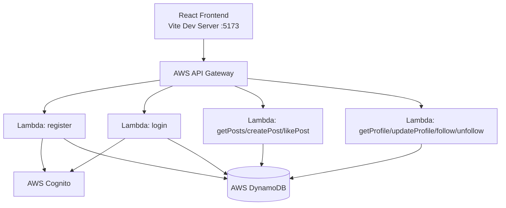
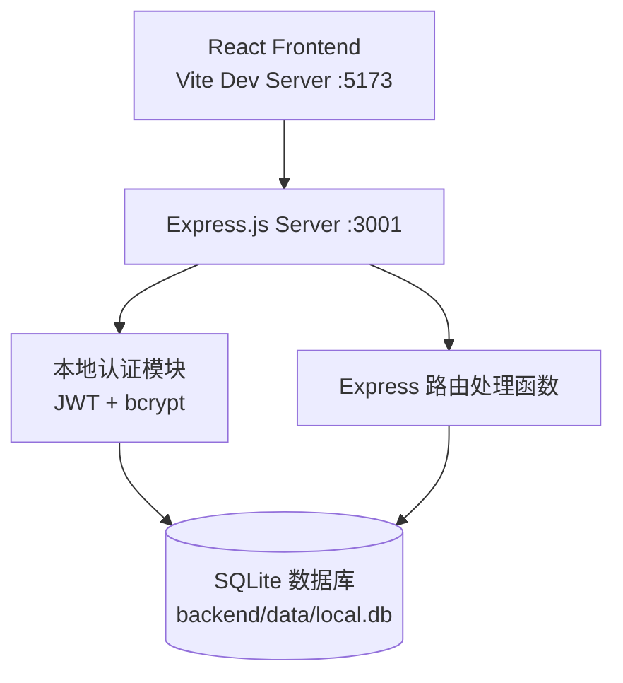

# 技术设计文档：本地开发环境搭建

## 概述

本设计将 Kiro Workshop 微博客全栈应用从 AWS 云端架构改造为完全本地运行。核心改造思路是：

- 用 **Express.js** 替代 AWS API Gateway + Lambda
- 用 **SQLite**（better-sqlite3）替代 AWS DynamoDB
- 用 **JWT + bcrypt** 替代 AWS Cognito

改造后，开发者无需 AWS 账号，只需 `npm install` + `npm run dev` 即可启动完整的前后端应用。

### 设计原则

1. **最小改动原则**：保持前端代码几乎不变，仅修改环境变量配置
2. **接口兼容原则**：本地 API 路由和响应格式与原 AWS API Gateway 完全一致
3. **数据模型映射**：SQLite 表结构忠实映射原 DynamoDB 表的字段和索引

## 架构

### 当前架构（AWS 云端）



### 目标架构（本地运行）



### 目录结构变更

```
backend/
├── src/
│   ├── server.js              # Express 服务器入口
│   ├── database.js            # SQLite 数据库初始化与连接
│   ├── middleware/
│   │   └── auth.js            # JWT 认证中间件
│   ├── routes/
│   │   ├── auth.js            # 注册/登录路由
│   │   ├── posts.js           # 帖子相关路由
│   │   └── users.js           # 用户相关路由
│   └── functions/             # (保留原 Lambda 代码，不修改)
├── data/                      # SQLite 数据库文件目录
│   └── local.db               # 数据库文件（gitignored）
├── .env                       # 本地环境变量
├── .env.example               # 环境变量示例
└── package.json               # 新增本地开发依赖
```

## 组件与接口

### 1. Express 服务器（server.js）

入口文件，负责：
- 加载 `.env` 配置（dotenv）
- 初始化 SQLite 数据库
- 注册 CORS 中间件
- 挂载路由
- 启动监听

```javascript
// 伪代码
const app = express();
app.use(cors());
app.use(express.json());

initDatabase(); // 自动建表

app.use('/auth', authRoutes);
app.use('/users', userRoutes);
app.use('/posts', postRoutes);

app.listen(PORT, () => console.log(`Server running on http://localhost:${PORT}`));
```

### 2. 数据库模块（database.js）

使用 better-sqlite3 同步 API，提供：
- `getDb()`: 返回数据库连接实例
- `initDatabase()`: 创建表和索引（IF NOT EXISTS）

```javascript
const Database = require('better-sqlite3');
const path = require('path');

let db;

function getDb() {
  if (!db) {
    const dbPath = process.env.DB_PATH || path.join(__dirname, '../data/local.db');
    db = new Database(dbPath);
    db.pragma('journal_mode = WAL');
    db.pragma('foreign_keys = ON');
  }
  return db;
}
```

### 3. 认证中间件（middleware/auth.js）

替代原 `common/middleware.js` 中的 Cognito 验证逻辑：

```javascript
// 验证流程
function withAuth(req, res, next) {
  // 1. 从 Authorization header 提取 Bearer token
  // 2. 使用 jsonwebtoken 验证签名和过期时间
  // 3. 将 { id, username } 附加到 req.user
  // 4. 失败返回 401
}
```

### 4. 路由模块

#### auth.js 路由
| 方法 | 路径 | 说明 |
|------|------|------|
| POST | /auth/register | 注册：bcrypt 哈希密码，存入 SQLite，返回用户信息 |
| POST | /auth/login | 登录：bcrypt 验证密码，签发 JWT，返回 token + 用户信息 |

#### users.js 路由
| 方法 | 路径 | 说明 |
|------|------|------|
| GET | /users/:userId | 获取用户资料（排除 passwordHash） |
| PUT | /users/:userId | 更新用户资料（仅 displayName/bio/avatarUrl） |
| POST | /users/:userId/follow | 关注用户 |
| POST | /users/:userId/unfollow | 取消关注 |
| GET | /users/:userId/following | 查询关注状态 |

#### posts.js 路由
| 方法 | 路径 | 说明 |
|------|------|------|
| GET | /posts | 获取帖子列表（支持 limit/sortBy/userId/nextToken） |
| POST | /posts | 创建帖子 |
| GET | /users/:userId/posts | 获取指定用户的帖子（复用 getPosts 逻辑） |
| POST | /posts/:postId/like | 点赞帖子 |

### 5. 前端适配

前端改动极小，仅需：
- 将 `frontend/.env` 中的 `VITE_API_URL` 改为 `http://localhost:3001`
- 移除不再需要的 `VITE_USER_POOL_ID`、`VITE_USER_POOL_CLIENT_ID`、`VITE_IDENTITY_POOL_ID`（本地模式不使用 Cognito）
- 提供 `.env.local` 示例文件

前端 `api.ts` 无需修改，因为它已经通过 `VITE_API_URL` 动态构建请求地址，且使用标准的 Bearer token 认证。

## 数据模型

### SQLite 表结构

#### users 表

```sql
CREATE TABLE IF NOT EXISTS users (
  id TEXT PRIMARY KEY,
  username TEXT NOT NULL UNIQUE,
  email TEXT NOT NULL,
  displayName TEXT NOT NULL,
  bio TEXT DEFAULT '',
  avatarUrl TEXT DEFAULT '',
  passwordHash TEXT NOT NULL,
  createdAt TEXT NOT NULL,
  updatedAt TEXT NOT NULL,
  followersCount INTEGER DEFAULT 0,
  followingCount INTEGER DEFAULT 0
);

CREATE UNIQUE INDEX IF NOT EXISTS idx_users_username ON users(username);
```

#### posts 表

```sql
CREATE TABLE IF NOT EXISTS posts (
  id TEXT PRIMARY KEY,
  userId TEXT NOT NULL,
  content TEXT NOT NULL,
  createdAt TEXT NOT NULL,
  updatedAt TEXT NOT NULL,
  likesCount INTEGER DEFAULT 0,
  commentsCount INTEGER DEFAULT 0,
  FOREIGN KEY (userId) REFERENCES users(id)
);

CREATE INDEX IF NOT EXISTS idx_posts_userId ON posts(userId);
CREATE INDEX IF NOT EXISTS idx_posts_createdAt ON posts(createdAt);
```

#### likes 表

```sql
CREATE TABLE IF NOT EXISTS likes (
  userId TEXT NOT NULL,
  postId TEXT NOT NULL,
  createdAt TEXT NOT NULL,
  PRIMARY KEY (userId, postId),
  FOREIGN KEY (userId) REFERENCES users(id),
  FOREIGN KEY (postId) REFERENCES posts(id)
);
```

#### follows 表

```sql
CREATE TABLE IF NOT EXISTS follows (
  followerId TEXT NOT NULL,
  followeeId TEXT NOT NULL,
  createdAt TEXT NOT NULL,
  PRIMARY KEY (followerId, followeeId),
  FOREIGN KEY (followerId) REFERENCES users(id),
  FOREIGN KEY (followeeId) REFERENCES users(id)
);

CREATE INDEX IF NOT EXISTS idx_follows_followeeId ON follows(followeeId);
```

### DynamoDB → SQLite 映射说明

| DynamoDB 概念 | SQLite 对应 |
|--------------|-------------|
| 分区键 (Partition Key) | PRIMARY KEY |
| 排序键 (Sort Key) | 复合 PRIMARY KEY |
| GSI (username-index) | UNIQUE INDEX on username |
| GSI (userId-index) | INDEX on userId |
| GSI (postId-index) | 复合 PRIMARY KEY (userId, postId) |
| GSI (followee-index) | INDEX on followeeId |
| 条件写入 (ConditionExpression) | UNIQUE 约束 + INSERT OR IGNORE |


## 正确性属性（Correctness Properties）

*属性（Property）是指在系统所有有效执行中都应成立的特征或行为——本质上是对系统应做什么的形式化陈述。属性是人类可读规范与机器可验证正确性保证之间的桥梁。*

### 属性 1：CORS 头存在性

*对于任意* HTTP 请求方法和任意有效路由路径，服务器的响应都应包含 `Access-Control-Allow-Origin` 头。

**验证需求：1.3**

### 属性 2：数据库初始化幂等性

*对于任意* 次数的 `initDatabase()` 调用（1 次、2 次、N 次），调用后数据库中应始终存在 users、posts、likes、follows 四张表，且不产生错误。

**验证需求：2.7**

### 属性 3：注册-登录往返一致性

*对于任意* 有效的用户名、邮箱和密码组合，先注册再用相同凭据登录，应成功返回包含该用户 id 和 username 的 JWT 令牌。

**验证需求：3.1, 3.3**

### 属性 4：用户名唯一性约束

*对于任意* 已注册的用户名，使用相同用户名再次注册应返回 HTTP 409 状态码，且数据库中该用户名对应的记录数仍为 1。

**验证需求：2.3, 3.2**

### 属性 5：JWT 令牌往返完整性

*对于任意* 用户，签发的 JWT 令牌经中间件验证后，解码出的 `id` 和 `username` 应与原始用户信息一致，且令牌的过期时间应在签发时间后约 24 小时。

**验证需求：3.4, 3.5**

### 属性 6：帖子内容验证边界

*对于任意* 字符串，若其 trim 后非空且长度 ≤ 280 字符，则创建帖子应成功；若为空白字符串或长度 > 280 字符，则应被拒绝且帖子总数不变。

**验证需求：4.1**

### 属性 7：帖子列表排序正确性

*对于任意* 数据库中的帖子集合，以 `sortBy=newest` 查询时返回的帖子应按 `createdAt` 降序排列；以 `sortBy=popular` 查询时应按 `likesCount` 降序排列。且返回数量不超过 `limit` 参数值。

**验证需求：4.2**

### 属性 8：点赞操作正确性

*对于任意* 帖子和用户，首次点赞应使该帖子的 `likesCount` 增加 1；对同一帖子再次点赞应返回错误，且 `likesCount` 不再变化。

**验证需求：2.5, 4.3**

### 属性 9：用户资料响应数据安全性

*对于任意* 用户资料查询请求，返回的 JSON 对象中不应包含 `passwordHash` 字段。

**验证需求：4.4**

### 属性 10：用户资料更新授权与字段限制

*对于任意* 用户 A 和用户 B（A ≠ B），用户 A 尝试更新用户 B 的资料应返回 HTTP 403。*对于任意* 用户更新自己的资料时，仅 `displayName`、`bio`、`avatarUrl` 字段应被更新，其他字段（如 `username`、`email`）应保持不变。

**验证需求：4.5**

### 属性 11：关注-取消关注往返一致性

*对于任意* 两个不同的用户 A 和 B，A 关注 B 后再取消关注，双方的 `followersCount` 和 `followingCount` 应恢复到关注前的值。自我关注应被拒绝。

**验证需求：2.6, 4.6, 4.7**

### 属性 12：关注状态查询一致性

*对于任意* 两个用户 A 和 B，`checkFollowing` 返回 `true` 当且仅当 follows 表中存在 (A, B) 的记录。

**验证需求：4.8**

## 错误处理

### HTTP 错误码映射

| 场景 | 状态码 | 响应体 |
|------|--------|--------|
| 请求体缺失或格式错误 | 400 | `{ message: "Missing request body" }` |
| 帖子内容为空 | 400 | `{ message: "Post content cannot be empty" }` |
| 帖子内容超长 | 400 | `{ message: "Post content cannot exceed 280 characters" }` |
| 重复点赞 | 400 | `{ message: "You have already liked this post" }` |
| 自我关注 | 400 | `{ message: "You cannot follow yourself" }` |
| 重复关注 | 400 | `{ message: "You are already following this user" }` |
| 未关注时取消关注 | 400 | `{ message: "You are not following this user" }` |
| JWT 缺失/无效/过期 | 401 | `{ message: "Authentication failed" }` |
| 更新他人资料 | 403 | `{ message: "You can only update your own profile" }` |
| 用户不存在 | 404 | `{ message: "User not found" }` |
| 帖子不存在 | 404 | `{ message: "Post not found" }` |
| 用户名已存在 | 409 | `{ message: "Username already exists" }` |
| 服务器内部错误 | 500 | `{ message: "Internal server error", error: "<详情>" }` |

### 错误处理策略

1. **路由级 try-catch**：每个路由处理函数用 try-catch 包裹，未预期的错误统一返回 500
2. **认证中间件错误**：JWT 验证失败直接返回 401，不进入路由处理函数
3. **数据库约束错误**：SQLite 的 UNIQUE 约束违反会抛出 `SQLITE_CONSTRAINT` 错误，在路由中捕获并转换为对应的 HTTP 错误码（如 409）
4. **启动错误**：数据库连接失败或表创建失败时，输出错误日志并 `process.exit(1)`

## 测试策略

### 双重测试方法

本项目采用单元测试 + 属性测试的双重策略：

- **单元测试**：验证具体示例、边界情况和错误条件
- **属性测试**：验证跨所有输入的通用属性

两者互补，缺一不可。

### 属性测试配置

- **测试库**：[fast-check](https://github.com/dubzzz/fast-check)（JavaScript/TypeScript 属性测试库）
- **测试框架**：Jest
- **每个属性测试最少运行 100 次迭代**
- **每个属性测试必须用注释引用设计文档中的属性编号**
- **标签格式**：`Feature: local-development-setup, Property {number}: {property_text}`

### 单元测试范围

单元测试聚焦于：
- 具体的 API 请求/响应示例（如注册成功返回 201）
- 边界情况（如空请求体、缺失 Authorization 头、过期 JWT）
- 数据库初始化后表结构验证
- 服务器启动配置验证

### 属性测试范围

每个正确性属性对应一个属性测试：

| 属性 | 测试描述 | 生成器 |
|------|---------|--------|
| 属性 1 | CORS 头存在性 | 随机 HTTP 方法 + 随机有效路由 |
| 属性 2 | 数据库初始化幂等性 | 随机调用次数 (1-10) |
| 属性 3 | 注册-登录往返 | 随机用户名/邮箱/密码 |
| 属性 4 | 用户名唯一性 | 随机用户名 |
| 属性 5 | JWT 往返完整性 | 随机用户 id/username |
| 属性 6 | 帖子内容验证 | 随机字符串（含空白、超长、正常） |
| 属性 7 | 帖子排序正确性 | 随机帖子集合 + 随机 sortBy/limit |
| 属性 8 | 点赞操作正确性 | 随机用户 + 随机帖子 |
| 属性 9 | 资料响应安全性 | 随机用户 |
| 属性 10 | 资料更新授权 | 随机用户对 + 随机更新字段 |
| 属性 11 | 关注-取消关注往返 | 随机用户对 |
| 属性 12 | 关注状态查询一致性 | 随机用户对 + 随机关注状态 |

### 测试文件结构

```
backend/
├── __tests__/
│   ├── unit/
│   │   ├── auth.test.js        # 认证相关单元测试
│   │   ├── posts.test.js       # 帖子相关单元测试
│   │   ├── users.test.js       # 用户相关单元测试
│   │   └── database.test.js    # 数据库初始化单元测试
│   └── property/
│       ├── auth.property.test.js    # 属性 3, 4, 5
│       ├── posts.property.test.js   # 属性 6, 7, 8
│       ├── users.property.test.js   # 属性 9, 10, 11, 12
│       └── server.property.test.js  # 属性 1, 2
```
